# Zigbee2mqtt 
# ou Comment garder les données de ses objets Zigbee en local

**Zigbee2mqtt** est un projet Open Source qui permet de gérer des objets connectés utilisant le protocole `Zigbee`, sans devoir passer par les passerelles des fabricants, qui leur permettent d'amasser vos données personnelles sur leurs serveurs, dans le cloud.

Pour cela, **Zigbee2mqtt** utilise une interface matérielle radio Zigbee, basée sur les puces `CC2530` et `CC2531` de Texas Instruments, pour communiquer avec les objets.  
Cette interface devra être flashée avec un firmware spécifique.

**Zigbee2mqtt** fait le lien entre l'interfce matérielle et tout logiciel de domotique, à l'aide d'un broker **MQTT**.  

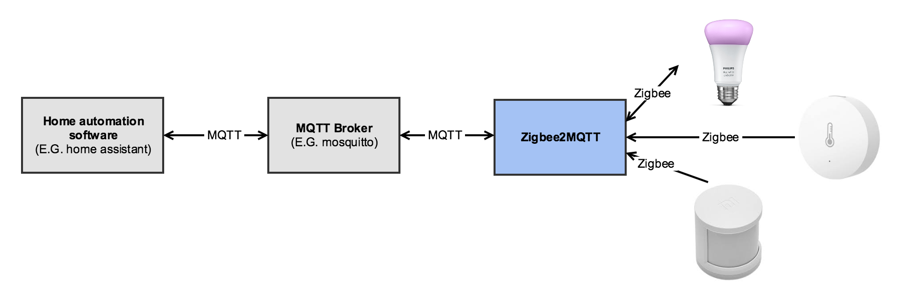
©️ Koen Kanters (http://zigbee2mqtt.io)

La liste du matériel supporté est impressionante : [Zigbee2mqtt Supported Devices](https://www.zigbee2mqtt.io/information/supported_devices.html) 🥇

En intégrant un service dédié **Zigbee2mqtt** dans Gladys, on profite ainsi du support de tout ce matériel... 👍

Par rapport à Gladys, voici donc comment cela se présente :

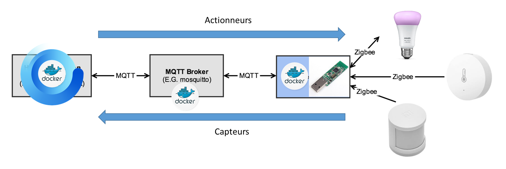

>PS : Un grand merci à [Koen Kanters](https://github.com/Koenkk) pour tous ses développements autour de **Zigbee2mqtt**. 👏

## Matériel nécessaire

Il y a deux façons de s'équiper pour utiliser **Zigbee2mqtt** : le mode "DIY" et le mode "clés en main".

Le mode "DIY" est destiné :
- ~~aux radins~~ à ceux qui souhaitent optimiser leur budget
- à ceux qui ont une grande maison et envisagent d'utiliser plusieurs dongles pour couvrir tout l'espace associé.
  
Pour ceux qui ne souhaitent pas perdre de temps, choisissez le mode "clés en main".  

### Mode DIY

#### Achats
  
Zigbee2mqtt nécessite l'utilisation d'une interface matérielle pour faire le lien radio avec vos équipements `Zigbee`.

Le plus simple est d'utiliser le [dongle Zigbee USB Sniffer de TI](http://www.ti.com/tool/CC2531EMK).

<div align="center">
  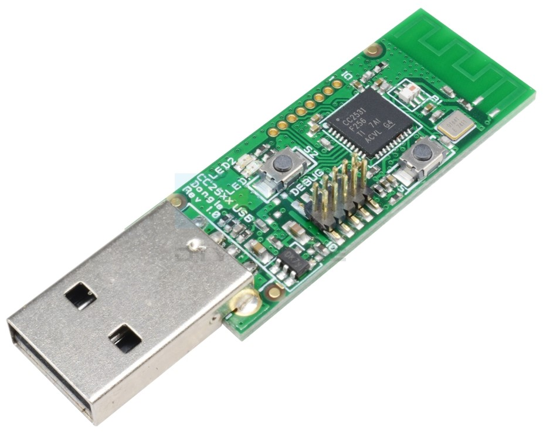
</div>

On le trouve sur AliExpress autour de 3€ ou encore sur Amazon pour environ 17€ les 2.

Il n'est pas utilisable en l'état car il faut le programmer avec un firmware spécial, appelé [Z-Stack-firmware](https://github.com/Koenkk/Z-Stack-firmware) et développé par [Koen Kanters](https://github.com/Koenkk) l'auteur de **Zigbee2mqtt**.

Pour flasher le firmware [Z-Stack-firmware](https://github.com/Koenkk/Z-Stack-firmware), il faut un programmateur appelé [CC debugger](http://www.ti.com/tool/CC-DEBUGGER).

<div align="center">
  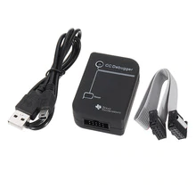
</div>

Celui-ci se trouve sur Aliexpress pour environ 8€.  

>Attention : Il faut vérifier que le câble de programmation adapté au dongle soit bien livré avec (le moins large sur la photo suivante).  

<div align="center">
  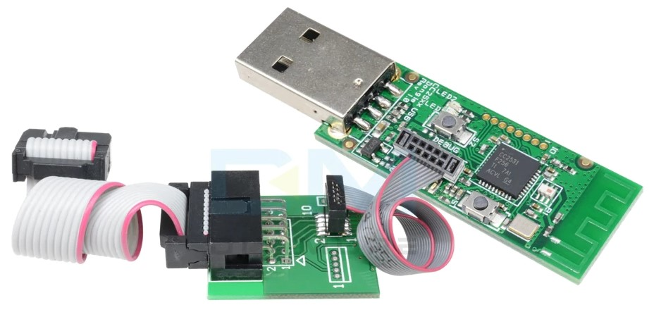
</div>

Certains vendeurs l'incluent avec le [CC debugger](http://www.ti.com/tool/CC-DEBUGGER) et d'autres non !  
Le câble peut s'acheter seul pour environ 1€.

Pour augmenter la portée de communication du dongle avec les objets `Zigbee`, il est également possible de souder un connecteur SMA à la place de l'antenne intégrée afin d'y visser une antenne externe.

<div align="center">
  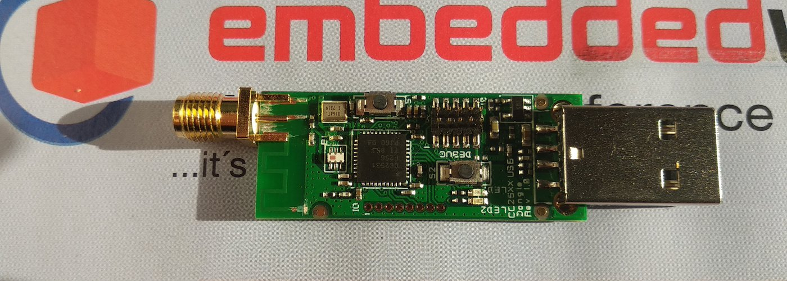
</div>

Pour la procédure, allez faire un tour sur [Hackaday](https://hackaday.io/project/163505-cc2531-usb-adapter-antenna-mod)


#### Flash du firmware

Tout est expliqué sur le site [**Zigbee2mqtt**](https://www.zigbee2mqtt.io/getting_started/flashing_the_cc2531.html).  

Pour flasher le firmware, il faut :
- installer le logiciel [SmartRF Flash programmer](http://www.ti.com/tool/flash-programmer) (pas la V2)
- Télécharger le firmware [CC2531_DEFAULT_20190608.zip](https://github.com/Koenkk/Z-Stack-firmware/raw/master/coordinator/Z-Stack_Home_1.2/bin/default/CC2531_DEFAULT_20190608.zip)
- Connecter le dongle sur le CC Debugger et brancher ce dernier à votre machine.  
  La Led du CC Debugger doit s'allumer en vert. Si ce n'est pas le cas, essayez de connecter, dans l'autre sens, le petit connecteur sur le dongle. Ne vous inquiétez pas; le sens de connexion n'entraîne pas de risque de détèrioration.  
  Ex : Voici à quoi ressemble le câblage chez moi

  <div align="center">
  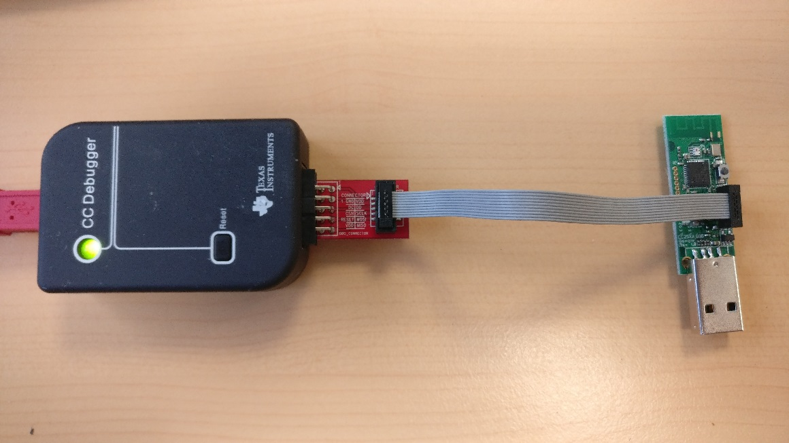
</div>

- Lancer SmartRF Flash programmer, sélectionner l'image à flasher téléchargée précédemment, `Erase, program and Verify` puis cliquer `Perform actions`
  
<div align="center">
  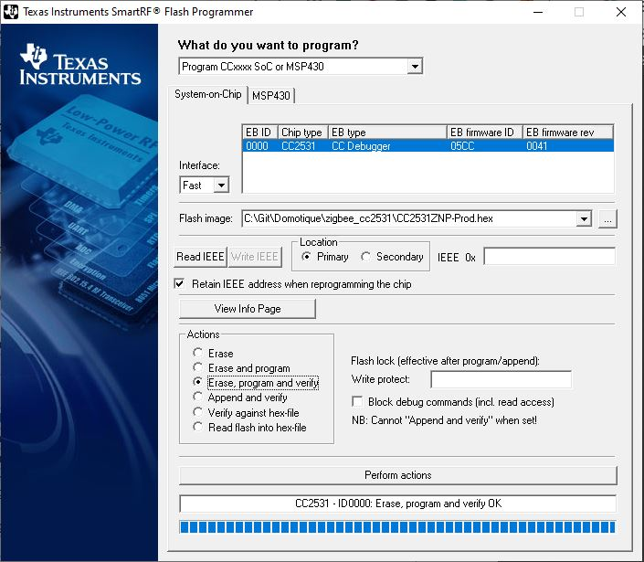
</div>

Voilà, Félicitations !!!  

Vous devez maintenant être en possession d'un dongle **Zigbee2mqtt** !  
Vous pouvez être fier de vous !  ;-)

### Mode clé en main

Si les étapes précédentes vous rebutent ou si vous êtes pressés, il existe des solutions toutes prêtes sur le net, c'est-à-dire comprenant le dongle CC2531 programmé avec le firmware `Z-Stack-firmware`, avec ou sans antenne externe.  

On trouve des solutions de ce style sur eBay pour environ 25€.  
On en parle sur le forum :  
https://community.gladysassistant.com/t/v4-integration-zigbee2mqtt/5009/6

## Partie logicielle

**Zigbee2mqtt** a besoin de communiquer avec un broker **MQTT** de façon à transmettre les données issues des capteurs Zigbee et recevoir les états pour commander les actionneurs Zigbee.
C'est ce broker **MQTT** qui fera le lien avec **Gladys**.

Comme vous le savez sans doute, la V4 de **Gladys** est déployée sous forme de container Docker.  
**Zigbee2mqtt** est également disponible sous forme de container Docker et on trouve facilement des images Docker de brokers **MQTT**.  

Du coup, nous allons tout installer à l'aide du fabuleux outil qu'est Docker ! 👍

Aujourd'hui, version beta oblige, nous devons lancer les containers, "à la main", en ligne de commande mais nous travaillons à rendre cette étape plus facile, en effectuant les lancements des containers, directement depuis l'interface de **Gladys**.

Pour pouvoir avancer sur les tests du module **Zigbee2mqtt** et simplifier ceux-ci, je me suis permis de générer une image de **Gladys** intégrant le service **Zigbee2mqtt**.  
Cela permet d'éviter à tous de se créer une machine de développement, ce qui n'est pas forcément trivial pour celui qui n'a pas l'habitude.  
@Pierre-Gilles, si cette façon de procéder ne te convient pas, n'hésite pas à le dire et je supprimerai cette version du Docker Hub.

### Méthode manuelle avec lancement individuel

- Lancement de **Gladys**

  ```sh
  docker network create gladys-net

  docker run -d \
      --restart=always \
      --privileged \
      --network=gladys-net \
      --name gladys-zigbee2mqtt \
      -p 80:80 \
      -e NODE_ENV=production \
      -e SERVER_PORT=80 \
      -e TZ=Europe/Paris \
      -e SQLITE_FILE_PATH=/var/lib/gladysassistant/gladys-production.db \
      -v /var/run/docker.sock:/var/run/docker.sock \
      -v ${PWD}/gladysassistant:/var/lib/gladysassistant \
      -v /dev:/dev \
      r6n0/gladys-zigbee2mqtt:4.0.0-beta-arm
  ```

  On créé d'abord un réseau nommé `gladys-net`qui permettront aux autres containers de communiquer avec **Gladys**.  
  `--network` permet d'indiquer que **Gladys** utilise ce réseau.

- Lancement de **MQTT**

  ```sh
  docker run -d \
    --restart=always \
    --network=gladys-net \
    --name mqtt-broker \
    -p 1883:1883 \
    eclipse-mosquitto
  ```
  avec `--network`, on connecte mqtt à **Gladys**

- Lancement de **Zigbee2mqtt**  
  On créé le fichier de configuration `configuration.yaml` pour Zigbee2mqtt

  ```sh
  > mkdir -p zigbee2mqtt/data
  > nano zigbee2mqtt/data/configuration.yaml

  homeassistant: false
  permit_join: true
  mqtt:
    base_topic: zigbee2mqtt
    server: 'mqtt://mqtt-broker'
  serial:
    port: /dev/ttyACM0
  ```

  puis on lance le container

  ```sh
  docker run -d \
      --restart=always \
      --network=gladys-net \
      --name zigbee2mqtt \
      -v ${PWD}/zigbee2mqtt/data:/app/data \
      --device=/dev/ttyACM0:/dev/ttyACM0 \
      koenkk/zigbee2mqtt
  ```

où `/dev/ttyACM0` représente l'interface USB sur laquelle est connecté le dongle CC2531.  
Le nom de cette interface peut varier en fonction du nombre de périphériques connectés sur les ports USB.

- Scripts de lancement  
Afin de faciliter le lancement et la configuration des différents containers, j'ai créé des scripts de démarrage qui sont disponibles sur le Github du Tuto.  
  - `gladys-zigbee2mqtt_run.sh` permet de lancer et configurer tous les containers.  
  Il fait appel à des scripts indépendants pour chacun des containers
  - `gladys_run.sh` pour lancer **Gladys**
  - `mqtt_run.sh` pour lancer **MQTT**
  - `zigbee2mqtt_run.sh` pour lancer **Zigbee2mqtt**  
  Notez que ce dernier recherche automatiquement l'interface `/dev/ttyX` sur laquelle est connectée le dongle.

  Pour les utiliser, il faut copier tous les scripts dans un répertoire dédié.  
  Il faut ensuite rendre ces scripts exécutables avec la commande :  
  ```sh
  chmod +x *.sh
  ```
  
  Il ne reste plus qu'à exécuter le script principal qui fait appel aux autres pour lancer les différents containers :
  ```sh
    ./gladys-zigbee2mqtt_run.sh
  ```

### Méthode manuelle avec lancement global

On peut également lancer tous les containers via l'outil `docker-compose`.  
Si ça intéresse certains, je pourrai développer cette partie.

### Vérification du bon fonctionnement

Une fois tous les containers démarrés, il est conseillé de vérifier le bon fonctionnement de tout ça.

- Vérification du lancement  
  Pour vérifier que les 3 containers ont bien été lancés, on tape la commande :

```sh
> docker ps
CONTAINER ID        IMAGE                                    COMMAND                  CREATED             STATUS              PORTS                    NAMES
e91946484eb2        koenkk/zigbee2mqtt:arm32v6               "./run.sh"               11 minutes ago      Up 11 minutes                                zigbee2mqtt
b4d2130daaba        eclipse-mosquitto                        "/docker-entrypoint.…"   11 minutes ago      Up 11 minutes       0.0.0.0:1883->1883/tcp   mqtt-broker
531b38750118        r6n0/gladys-zigbee2mqtt:4.0.0-beta-arm   "docker-entrypoint.s…"   2 hours ago         Up 37 minutes       0.0.0.0:80->80/tcp       gladys-zigbee2mqtt

```

- Vérification du fonctionnement de **Gladys**

```sh
$ docker logs gladys-zigbee2mqtt

> gladys-server@ start:prod /src/server
> npm run db-migrate:prod && cross-env NODE_ENV=production node index.js


> gladys-server@ db-migrate:prod /src/server
> cross-env NODE_ENV=production node_modules/.bin/sequelize db:migrate


Sequelize CLI [Node: 12.13.1, CLI: 5.5.1, ORM: 4.44.3]

Loaded configuration file "config/config.js".
Using environment "production".
== 20190205063641-create-user: migrating =======
== 20190205063641-create-user: migrated (0.116s)

== 20190206102938-create-location: migrating =======
== 20190206102938-create-location: migrated (0.093s)

== 20190206114851-create-house: migrating =======
== 20190206114851-create-house: migrated (0.056s)

== 20190211033038-create-life-event: migrating =======
== 20190211033038-create-life-event: migrated (0.105s)

== 20190211034727-create-room: migrating =======
== 20190211034727-create-room: migrated (0.068s)

== 20190211035101-create-device: migrating =======
== 20190211035101-create-device: migrated (0.092s)

== 20190211035238-create-device-feature: migrating =======
== 20190211035238-create-device-feature: migrated (0.091s)

== 20190211041243-create-device-feature-state: migrating =======
== 20190211041243-create-device-feature-state: migrated (0.075s)

== 20190211042223-create-calendar: migrating =======
== 20190211042223-create-calendar: migrated (0.090s)

== 20190211042644-create-calendar-event: migrating =======
== 20190211042644-create-calendar-event: migrated (0.110s)

== 20190211043231-create-pod: migrating =======
== 20190211043231-create-pod: migrated (0.073s)

== 20190211043515-create-service: migrating =======
== 20190211043515-create-service: migrated (0.125s)

== 20190211043957-create-variable: migrating =======
== 20190211043957-create-variable: migrated (0.230s)

== 20190211044205-create-script: migrating =======
== 20190211044205-create-script: migrated (0.063s)

== 20190211044442-create-area: migrating =======
== 20190211044442-create-area: migrated (0.059s)

== 20190211044839-create-dashboard: migrating =======
== 20190211044839-create-dashboard: migrated (0.055s)

== 20190211045110-create-scene: migrating =======
== 20190211045110-create-scene: migrated (0.058s)

== 20190211045641-create-trigger: migrating =======
== 20190211045641-create-trigger: migrated (0.054s)

== 20190211050844-trigger_scene: migrating =======
== 20190211050844-trigger_scene: migrated (0.132s)

== 20190211051215-create-message: migrating =======
== 20190211051215-create-message: migrated (0.103s)

== 20190212043623-create-session: migrating =======
== 20190212043623-create-session: migrated (0.075s)

== 20190318084429-create-device-param: migrating =======
== 20190318084429-create-device-param: migrated (0.099s)

Initialising OpenZWave 1.4.164 binary addon for Node.JS.
        OpenZWave Security API is ENABLED
        ZWave device db    : /usr/etc/openzwave/
        User settings path : /src/server/services/zwave/node_modules/openzwave-shared/build/Release/../../
        Option Overrides : --Logging false --ConsoleOutput false --SaveConfiguration true
2019-12-01T23:14:05+0100 <info> index.js:20 (Object.start) Starting Dark Sky service
2019-12-01T23:14:05+0100 <info> index.js:16 (Object.start) Starting zwave service
2019-12-01T23:14:05+0100 <info> index.js:19 (Object.start) Starting telegram service
2019-12-01T23:14:05+0100 <info> index.js:13 (Object.start) Starting usb service
2019-12-01T23:14:05+0100 <info> service.start.js:16 (Service.start) Service darksky is not configured, so it was not started.
2019-12-01T23:14:05+0100 <info> service.start.js:16 (Service.start) Service zwave is not configured, so it was not started.
2019-12-01T23:14:05+0100 <info> service.start.js:16 (Service.start) Service telegram is not configured, so it was not started.
2019-12-01T23:14:05+0100 <info> service.start.js:16 (Service.start) Service mqtt is not configured, so it was not started.
2019-12-01T23:14:05+0100 <info> index.js:63 (Server.<anonymous>) Server listening on port 80
```

- Vérification du fonctionnement de **MQTT**

```sh
> docker logs mqtt-broker
1575244114: mosquitto version 1.6.7 starting
1575244114: Config loaded from /mosquitto/config/mosquitto.conf.
1575244114: Opening ipv4 listen socket on port 1883.
1575244114: Opening ipv6 listen socket on port 1883.
1575244115: New connection from 172.20.0.2 on port 1883.
1575244115: New client connected from 172.20.0.2 as mqttjs_1cda6e93 (p2, c1, k60).
```

Vous devez voir 1 client connecté au broker **MQTT** qui correspondent au container **Zigbee2mqtt**.  
Le container **Gladys** n'est pas encore connecté car nous n'avons pas encore configuré le service **MQTT** dans **Gladys**.

- Vérification du fonctionnement de Zigbee2mqtt
  
```sh
> docker logs zigbee2mqtt
Using '/app/data' as data directory

> zigbee2mqtt@1.6.0 start /app
> node index.js

  zigbee2mqtt:info 12/1/2019, 10:59:27 PM Logging to directory: '/app/data/log/2019-12-01.22-59-26'
  zigbee2mqtt:info 12/1/2019, 10:59:27 PM Starting zigbee2mqtt version 1.6.0 (commit #e26ad2a)
  zigbee2mqtt:info 12/1/2019, 10:59:27 PM Starting zigbee-shepherd
  zigbee2mqtt:info 12/1/2019, 10:59:29 PM zigbee-shepherd started
  zigbee2mqtt:info 12/1/2019, 10:59:29 PM Coordinator firmware version: '20190223'
  zigbee2mqtt:info 12/1/2019, 10:59:29 PM Currently 0 devices are joined:
  zigbee2mqtt:warn 12/1/2019, 10:59:29 PM `permit_join` set to  `true` in configuration.yaml.
  zigbee2mqtt:warn 12/1/2019, 10:59:29 PM Allowing new devices to join.
  zigbee2mqtt:warn 12/1/2019, 10:59:29 PM Set `permit_join` to `false` once you joined all devices.
  zigbee2mqtt:info 12/1/2019, 10:59:29 PM Zigbee: allowing new devices to join.
  zigbee2mqtt:info 12/1/2019, 10:59:29 PM Connecting to MQTT server at mqtt://mqtt-broker
  zigbee2mqtt:info 12/1/2019, 10:59:29 PM zigbee-shepherd ready
  zigbee2mqtt:info 12/1/2019, 10:59:29 PM Connected to MQTT server
  zigbee2mqtt:info 12/1/2019, 10:59:29 PM MQTT publish: topic 'zigbee2mqtt/bridge/state', payload 'online'
  zigbee2mqtt:info 12/1/2019, 10:59:29 PM MQTT publish: topic 'zigbee2mqtt/bridge/config', payload '{"version":"1.6.0","commit":"e26ad2a","coordinator":20190223,"log_level":"info","permit_join":true}'
```
 
Ensuite, appairez un objet `Zigbee` (en général, on appuie quelques secondes sur le bouton d'appairage de l'objet) et relancez la commande `docker logs zigbee2mqtt`, vous devriez voir apparaître des messages indiquant l'association de votre matériel.  
L'appairage des objets est parfois capricieux. 😫 Il suffit d'insister et ça finit par passer. 😏  
Faites-en de même pour tous les objets `Zigbee` que vous possédez.  

Voici le type de données visibles dans le log :

```sh
  zigbee2mqtt:info 12/1/2019, 11:05:10 PM New device 'undefined' with address 0x00aaaaaaaaaaaaaa connected!
  zigbee2mqtt:info 12/1/2019, 11:05:10 PM MQTT publish: topic 'zigbee2mqtt/bridge/log', payload '{"type":"device_connected","message":"0x00aaaaaaaaaaaaaa","meta":{}}'
  zigbee2mqtt:info 12/1/2019, 11:05:54 PM MQTT publish: topic 'zigbee2mqtt/0x00aaaaaaaaaaaaaa', payload '{"temperature":27.21,"linkquality":65,"humidity":50.48,"pressure":988}'
```

## Intégration dans Gladys

Connectez-vous à **Gladys**.
La première étape consiste à connecter **Gladys** au broker **MQTT**.  
On se place sur l'onglet `Integrations`, on choisit le service **MQTT** puis menu `Setup` et on rentre l'adresse de notre broker **MQTT** :
`mqtt://mqtt-broker:1883`

`mqtt-broker` correspond au nom de notre container **MQTT**  
On peut utiliser cette notation grâce à l'option `--network` que nous avons utilisée lors du lancement de nos containers. 👍

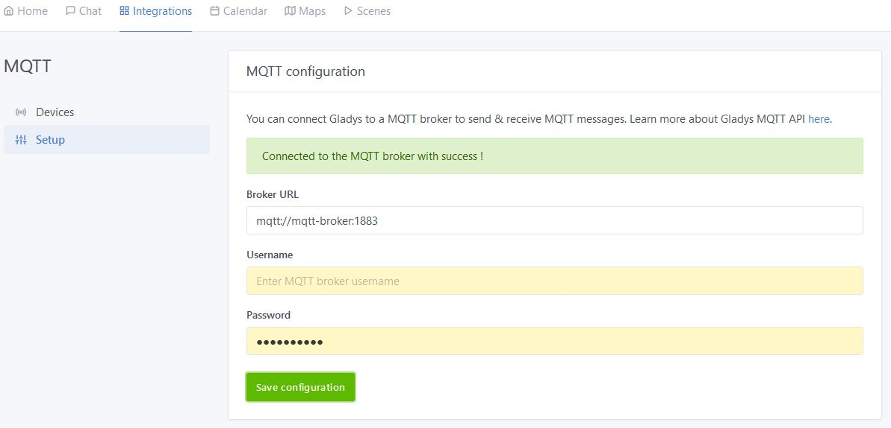

Pour utiliser le service Zigbee2mqtt, comme pour les autres services, rendez-vous sur l'onglet `Integrations`, sélectionnez **Zigbee2mqtt** puis `Setup` et cliquez sur le bouton `Scan`. 
Si vous avez appairé des objets, vous les voyez apparaître dans la fenêtre.

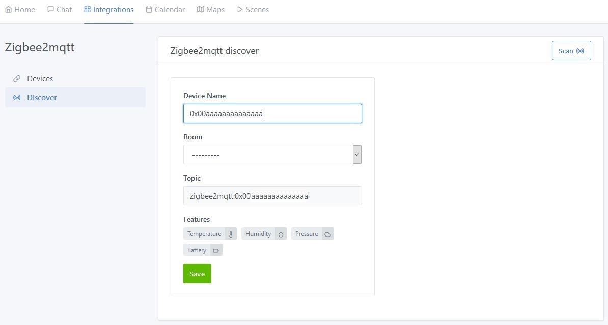

Saisissez un nom, affectez le à une pièce et cliquez sur `Save`.  

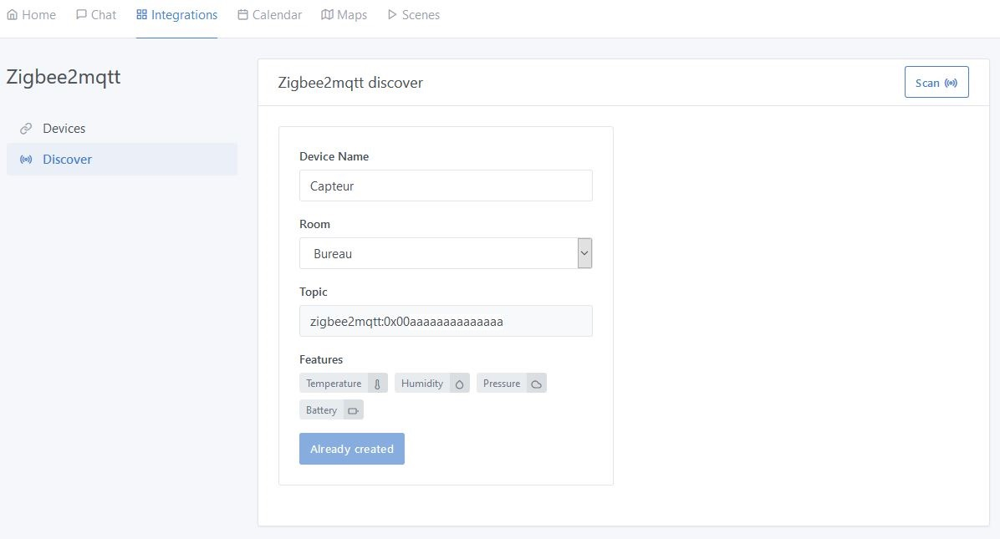

L'objet est maintenant créé et utilisable dans **Gladys**. 💪

On peut donc afficher ses informations sur le Dashboard.

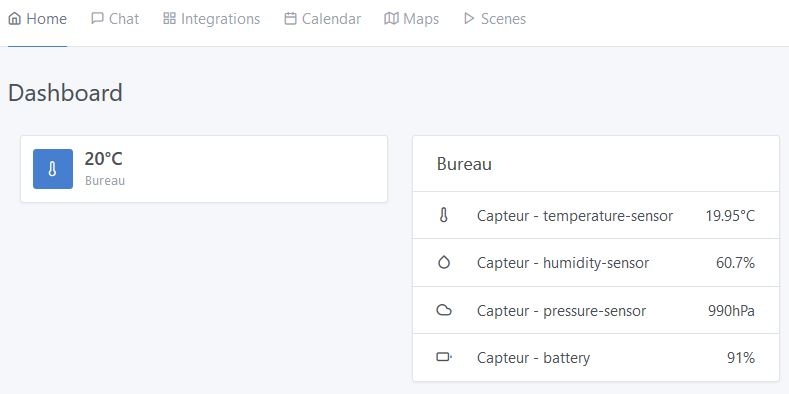

Faites-en de même avec tous vos objets Zigbee et configurez votre Dashboard pour obtenir de beaux affichages.

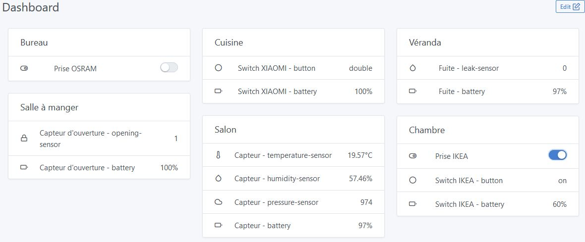

Amusez-vous bien !!! 🍾

## En cas de soucis

Si ça ne fonctionne pas comme indiqué ou si votre objet ne semble pas bien intégré, venez en parler sur le [forum](https://community.gladysassistant.com) en précisant le nom du modèle et en ajoutant les parties des logs **Zigbee2mqtt** et **Gladys** qui vous semblent intéressantes.

Enfin, si votre objet fonctionne correctement, laissez quand même un commentaire sur le [forum](https://community.gladysassistant.com) avec le nom du modèle, ça permettra de mettre à jour une liste du matéreil testé et ça fera toujours plaisir aux développeurs... ;-)

Merci d'avance !